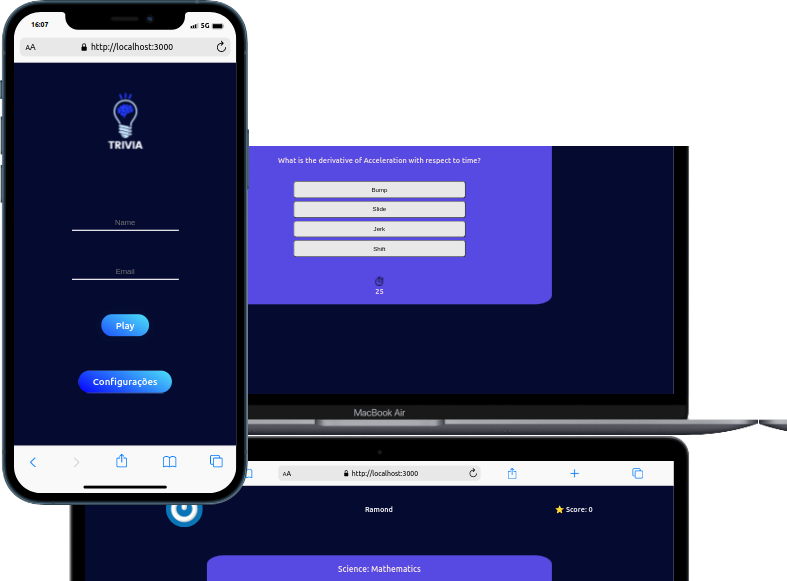

#  <h1 align="center">Projeto Trivia em React com Redux!</h1>

## Projeto desenvolvido em grupo

Ótima oportunidade de desenvolver as soft skills e metodologia ageis como Kanban que foi utilizada nesse projeto.

- [Leonardo Áraujo](https://github.com/Leo02452)
- [Leandro Lopes](https://github.com/LeandroALopes)
- [Manu](https://github.com/ManuCarniel)
- [Noelma](https://github.com/noelmagondim)

## O que foi desenvolvido

Desenvolvemos um jogo de perguntas e respostas baseado no jogo Trivia (tipo um show do milhão americano rs) utilizando React e Redux,

- Logar no jogo e, se o email tiver cadastro no site Gravatar, ter sua foto associada ao perfil da pessoa usuária.
- Acessar a página referente ao jogo, onde se deverá escolher uma das respostas disponíveis para cada uma das perguntas apresentadas. A resposta deve ser marcada antes do contador de tempo chegar a zero, caso contrário a resposta deverá ser considerada errada.
- Ser redirecionada, após 5 perguntas respondidas, para a tela de score, onde o texto mostrado depende do número de acertos.
- Visualizar a página de ranking, se quiser, ao final de cada jogo.
- Configurar algumas opções para o jogo em uma tela de configuração acessível a partir do cabeçalho do app.

# Habilidades

Nesse projeto, fomos capaz de:

- Criar um store Redux em aplicações React

- Criar reducers no Redux em aplicações React

- Criar actions no Redux em aplicações React

- Criar dispatchers no Redux em aplicações React

- Conectar Redux aos componentes React

- Criar actions assíncronas na sua aplicação React que faz uso de Redux.

## 🛠 Tecnologias

As seguintes ferramentas foram usadas na construção do projeto:

- [ReactJs](https://pt-br.reactjs.org/)
- [Javascript](https://developer.mozilla.org/en-US/docs/Web/JavaScript)
- [Css](https://developer.mozilla.org/en-US/docs/Web/CSS)
- [Redux](https://redux.js.org/)

## Instruções para abrir a aplicação
[Link Da Aplicação](https://ramondfalcao.github.io/trybe-wallet/)

1. Clone o repositório
  * `git clone git@github.com:ramondfalcao/trivia-game.git`
  * Entre na pasta do repositório que você acabou de clonar:
    * `cd trivia-game`

2. Instale as dependências e inicialize o projeto
  * Instale as dependências:
    * `npm install`
  * Inicialize o projeto:
    * `npm start` (uma nova página deve abrir no seu navegador)
---

<h4 align="center"> 
	🚧  Botão "Configurações" 🚀 Em construção...  🚧
</h4>